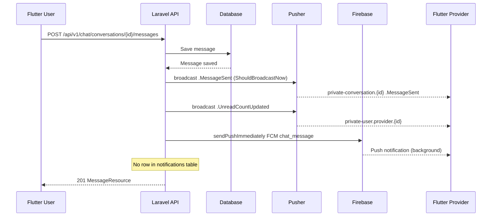

# دليل ربط Flutter مع المحادثة الفورية للمستخدم ومقدم الخدمة

Last updated: 2026-08-22

هذا الدليل موجّه لمطور Flutter الذي يبني تطبيق **العميل (Customer)** وتطبيق **مقدم الخدمة / الحرفي (Provider / Artisan)** فوق نظام المحادثة في Laravel.

تم استخراج العقد من الكود الحالي في هذا المستودع. لا يوجد مشروع Flutter داخل الـ workspace؛ أمثلة Dart و`pubspec` هي **توصيات** وليست مكتبات مؤكدة من تطبيق موجود.

> ملاحظة تحقق: تعذّر تشغيل `php artisan route:list` و`php artisan channel:list` لأن مجلد `vendor/` غير مثبت. المسارات والقنوات والأحداث موثّقة من ملفات المصدر:
> `app/Modules/Chat/routes/api.php`، `routes/channels.php`، `bootstrap/app.php`، Events، Controllers، Resources، Tests.

---

# 1. مقدمة

المحادثة في DarCare ليست قناة حرّة بين أي مستخدم وأي حرفي. المحادثة المرتبطة بالخدمة تُفتح فقط عبر `service_request` يملكه العميل ومُعيَّن له مقدّم الخدمة. بالإضافة إلى ذلك توجد محادثات دعم منفصلة مع الإدارة.

## الأدوار

| الطبقة | المسؤولية |
| --- | --- |
| Laravel | Source of Truth: المصادقة، الصلاحيات، حفظ الرسالة، حساب unread، البث، إرسال FCM |
| Flutter | واجهة المحادثة، REST للإرسال والقراءة، الاشتراك في Pusher للاستقبال الفوري، FCM للخلفية |
| Pusher Channels Cloud | توصيل أحداث Real-Time إلى الأجهزة المتصلة |
| Firebase Cloud Messaging | Push Notification عندما يكون التطبيق في الخلفية أو مغلقاً |

## REST مقابل Real-Time

- **REST API:** الكتابة والقراءة التاريخية. إرسال الرسالة، جلب السجل، mark read، قائمة المحادثات.
- **Real-Time Events:** إشعار فوري بأن شيئاً تغيّر. لا تُستخدم كسجل تاريخ، ولا كقناة كتابة.

إرسال الرسالة يتم عبر REST. استقبال الرسالة الفوري يتم عبر Pusher. Flutter **لا** يرسل الرسالة مباشرة إلى Pusher. Laravel هو المصدر الرئيسي للحقيقة.

```text
Flutter
   |
   | REST API
   v
Laravel
   |
   +---- Database
   |
   +---- Pusher ----> Flutter Real-Time
   |
   +---- FCM -------> Flutter Push Notification
```

---

# 2. سيناريو المحادثة الكامل

## من العميل إلى الحرفي

```text
User يكتب الرسالة في Flutter
↓
Flutter POST الرسالة إلى Laravel
↓
Laravel يتحقق من Sanctum ثم من صلاحية المحادثة
↓
Laravel يحفظ الرسالة في جدول messages
↓
Laravel يعيد الرسالة المخزّنة في JSON
↓
Laravel يبث .MessageSent عبر Pusher على قناة المحادثة
↓
تطبيق Provider المتصل يستقبل الحدث فوراً
↓
Laravel يرسل FCM إلى أجهزة Provider (إن وُجدت ولم تكن المحادثة مكتومة)
↓
Laravel يبث .UnreadCountUpdated على قناة Provider
```

## من الحرفي إلى العميل

نفس المسار بالعكس:

```text
Provider → POST Laravel → حفظ messages → رد REST للمرسل
         → Pusher .MessageSent → تطبيق User
         → FCM + .UnreadCountUpdated → User
```

الطلب `POST messages` ينتظر محاولة البث ومحاولة FCM داخل نفس الطلب (`ShouldBroadcastNow` + `sendPushImmediately`). الرسالة تبقى محفوظة حتى لو فشل Pusher أو Firebase.

---

# 3. لماذا لا نرسل الرسالة مباشرة عبر Pusher؟

Pusher في هذا المشروع **قناة استقبال فقط**.

Flutter يجب ألا يستخدم:

- `channel.trigger(...)`
- Client Events بأسماء `client-*`
- Pusher كـ Write Transport

الإرسال يمر عبر Laravel حتى يتم:

- Authentication عبر Sanctum
- Authorization عبر `ConversationPolicy`
- حفظ الرسالة في `messages`
- التحقق من ارتباط المحادثة بـ `service_request` عند النوع `request`
- منع انتحال المرسل (`sender` يُستنتج من التوكن)
- تطبيق `throttle:chat-send` (30 طلب/دقيقة)
- تطبيق idempotency عبر `client_message_id`
- تحديث `last_message_id` / `last_message_at`
- حساب unread للمستلمين
- إرسال FCM المناسب

إذا أرسل Flutter حدثاً عبر Pusher، لن تُحفظ الرسالة ولن يراها الطرف الآخر بعد إعادة فتح الشاشة.

---

# 4. Authentication

Flutter يستخدم Laravel Sanctum Bearer Token.

```http
Authorization: Bearer YOUR_SANCTUM_TOKEN
Accept: application/json
```

| التطبيق | Login | Actor في Laravel | الدور |
| --- | --- | --- | --- |
| العميل | `POST /api/v1/auth/login/user` | `User` | `role = user` |
| الحرفي | `POST /api/v1/auth/login/provider` | `Provider` | لا يوجد عمود `role`؛ `AuthResource` يعيد `"provider"` |

جسم تسجيل الدخول:

```json
{
  "email": "customer@example.com",
  "password": "secret"
}
```

غلاف النجاح:

```json
{
  "success": true,
  "message": "Login successful",
  "data": {
    "id": 15,
    "name": "...",
    "email": "...",
    "phone": "...",
    "role": "user",
    "profile_image": null,
    "token": "1|xxxxxxxx"
  },
  "errors": null
}
```

احفظ `token` و`id` في `flutter_secure_storage`. لا تطبع التوكن في logs. لا ترسل `sender_id` ولا `sender_type` مع الرسالة. Laravel يحدد المرسل من التوكن المصادق.

Backend الحالي **لا يتطلب** هذا الجسم، ولا يقرأه:

```json
{
  "sender_id": 1,
  "sender_type": "user"
}
```

الخروج:

```http
POST /api/v1/auth/logout
Authorization: Bearer YOUR_SANCTUM_TOKEN
```

جسم اختياري:

```json
{
  "device_token": "FCM_TOKEN"
}
```

إن وُجد `device_token` يتم إبطال هذا الجهاز فقط (`invalidated_at`) ثم حذف توكن Sanctum الحالي.

---

# 5. Packages المطلوبة في Flutter

لا يوجد `pubspec.yaml` لتطبيق Flutter في هذا المستودع. القائمة التالية **Recommendations**.

```yaml
dependencies:
  dio:
  flutter_secure_storage:
  pusher_channels_flutter:
  firebase_core:
  firebase_messaging:
  flutter_local_notifications:
  uuid:
  connectivity_plus:
```

| المكتبة | الاستخدام |
| --- | --- |
| `dio` | REST وطلب Broadcast Auth |
| `flutter_secure_storage` | تخزين توكن Sanctum |
| `pusher_channels_flutter` | الاشتراك في Private Channels |
| `firebase_core` / `firebase_messaging` | FCM |
| `flutter_local_notifications` | تنبيه محلي في المقدمة عند الحاجة |
| `uuid` | توليد `client_message_id` |
| `connectivity_plus` | إعادة المزامنة بعد عودة الشبكة |

لا تُثبت أرقام إصدارات هنا؛ ثبّتها في المشروع الحقيقي بعد التحقق من التوافق.

---

# 6. إعدادات Flutter

القيم التي يحتاجها العميل:

```text
API_BASE_URL
PUSHER_APP_KEY
PUSHER_CLUSTER
PUSHER_AUTH_ENDPOINT
```

`PUSHER_AUTH_ENDPOINT` الحقيقي في Laravel:

```text
https://YOUR_API_HOST/api/broadcasting/auth
```

هذا المسار **ليس** تحت `/api/v1`.

```dart
class AppConfig {
  static const apiBaseUrl = String.fromEnvironment(
    'API_BASE_URL',
  );

  static const pusherAppKey = String.fromEnvironment(
    'PUSHER_APP_KEY',
  );

  static const pusherCluster = String.fromEnvironment(
    'PUSHER_CLUSTER',
  );

  static const pusherAuthEndpoint = String.fromEnvironment(
    'PUSHER_AUTH_ENDPOINT',
  );

  static String get apiV1 => '$apiBaseUrl/api/v1';
}
```

```bash
flutter run \
  --dart-define=API_BASE_URL=https://api.example.com \
  --dart-define=PUSHER_APP_KEY=YOUR_PUSHER_APP_KEY \
  --dart-define=PUSHER_CLUSTER=YOUR_PUSHER_CLUSTER \
  --dart-define=PUSHER_AUTH_ENDPOINT=https://api.example.com/api/broadcasting/auth
```

خذ `PUSHER_APP_KEY` و`PUSHER_APP_CLUSTER` من إعدادات الخادم (`BROADCAST_CONNECTION=pusher`). لا تضع أسراراً في التطبيق.

اجعل مهلة استقبال إرسال الرسالة سخية (20–30 ثانية) لأن Laravel ينتظر بث Pusher ومحاولة FCM داخل نفس الطلب.

---

# 7. ما الذي يسمح بوضعه داخل Flutter؟

يُسمح في التطبيق:

```text
PUSHER_APP_KEY
PUSHER_CLUSTER
Firebase Android/iOS client configuration
API URL
```

ملفات العميل: `google-services.json` و`GoogleService-Info.plist`.

## تحذير أمني

**ممنوع مطلقاً** وضع أي مما يلي في Flutter أو في مستودع التطبيق:

```text
PUSHER_APP_SECRET
PUSHER_APP_ID (غير مطلوب للعميل)
Firebase service account JSON
Firebase private_key
Laravel APP_KEY
Database password
Backend API secrets
```

التفويض على القنوات الخاصة يتم عبر Laravel (`POST /api/broadcasting/auth`) وليس عبر السر في الجهاز.

---

# 8. Broadcast Authentication

## Endpoint الحقيقي

```http
POST /api/broadcasting/auth
```

التسجيل في `bootstrap/app.php`:

```php
->withBroadcasting(
    __DIR__.'/../routes/channels.php',
    ['prefix' => 'api', 'middleware' => ['api', 'auth:sanctum']],
)
```

أرسل:

```http
POST /api/broadcasting/auth
Authorization: Bearer YOUR_SANCTUM_TOKEN
Accept: application/json
Content-Type: application/x-www-form-urlencoded

socket_id=1234.5678
channel_name=private-conversation.27
```

Laravel يعيد توقيع الاشتراك. أعد هذا JSON كما هو إلى `onAuthorizer` في Pusher SDK.

## Authentication مقابل Channel Authorization

| المفهوم | السؤال | أين يحدث |
| --- | --- | --- |
| Authentication | من هو المستخدم؟ | Sanctum Bearer Token |
| Authorization | هل يُسمح له بهذه القناة؟ | `routes/channels.php` + `ConversationPolicy` |

فشل 401 يعني مشكلة توكن. فشل 403 يعني أن الممثل لا يملك هذه المحادثة أو هذا المعرّف.

---

# 9. Private Conversation Channel

Laravel يسجّل:

```text
conversation.{conversationId}
```

Flutter يشترك في الاسم الذي يضيفه Pusher للـ private:

```text
private-conversation.{conversationId}
```

مثال لمحادثة `27`:

```text
private-conversation.27
```

التحقق في `routes/channels.php` يستدعي `ConversationPolicy::view`. يُسمح بالاشتراك إذا كان:

- User العميل صاحب `service_request` المرتبط بالمحادثة من نوع `request`
- أو Provider المعيَّن حالياً لذلك الطلب
- أو الممثل مشاركاً نشطاً (`left_at = null`) في أي نوع محادثة
- أو Admin على محادثة دعم (خارج نطاق تطبيقي Flutter العميل/الحرفي)

لا يستطيع Flutter الاشتراك في محادثة عشوائية. لا تشترك إلا في `id` أعاده Backend لك.

---

# 10. الفرق بين User Channel وProvider Channel

القنوات الشخصية **مكتوبة بالنوع** حتى لا يتصادم `User.id = 10` مع `Provider.id = 10`.

| الممثل | اسم Laravel | اسم الاشتراك في Flutter |
| --- | --- | --- |
| عميل `User` | `user.user.{id}` | `private-user.user.{id}` |
| حرفي `Provider` | `user.provider.{id}` | `private-user.provider.{id}` |

أمثلة:

```text
private-user.user.15
private-user.provider.9
```

**لا تستخدم** `private-user.10`. هذا الاسم غير موجود ويسبب collision منطقياً.

هذه القناة تحمل `.UnreadCountUpdated` عند وصول رسالة للمستلم. خذ `{id}` من استجابة login/profile، لا تخمّنه.

---

# 11. Events

الأحداث المستخرجة من `app/Modules/Chat/Events` و`MessageNotificationService`.

| Event | Channel | يُبث فعلياً اليوم؟ | الاستخدام |
| --- | --- | --- | --- |
| `.MessageSent` | Conversation | نعم | وصول رسالة جديدة |
| `.UnreadCountUpdated` | User/Provider typed channel | نعم | تحديث عدد غير المقروء للمستلم |
| `.MessageRead` | Conversation | لا — الكلاس موجود فقط | إيصال قراءة (غير مفعّل) |
| `.ConversationUpdated` | Conversation | لا — الكلاس موجود فقط | تحديث حالة المحادثة (غير مفعّل) |

**غير موجودة ككلاسات:** `ConversationCreated`، `ConversationClosed`.

`NotificationCreated` موجود ككلاس إشعارات عامة، ولا يُستدعى من كود المحادثة، ولا يوجد `broadcast(new NotificationCreated(...))` في المشروع حالياً. **لا تعتمد عليه لمحادثة Flutter.**

اربط دفاعياً الاسم مع النقطة وبدونها (`MessageSent` و`.MessageSent`) لأن SDK قد يضيف البادئة.

---

# 12. إنشاء PusherService في Flutter

المثال متوافق مع واجهة `pusher_channels_flutter`: `getInstance()`, `init()`, `connect()`, `subscribe(channelName:)`, `unsubscribe(channelName:)`, `disconnect()`.

```dart
import 'dart:convert';

import 'package:dio/dio.dart';
import 'package:pusher_channels_flutter/pusher_channels_flutter.dart';

class PusherService {
  PusherService({
    required this.getToken,
    required this.apiKey,
    required this.cluster,
    required this.authEndpoint,
  });

  final Future<String?> Function() getToken;
  final String apiKey;
  final String cluster;
  final String authEndpoint;

  final PusherChannelsFlutter _pusher = PusherChannelsFlutter.getInstance();
  String _connectionState = 'DISCONNECTED';
  final Set<String> _subscribed = {};

  String get connectionState => _connectionState;
  bool get isConnected => _connectionState == 'CONNECTED';

  Future<void> initialize({required String token}) async {
    await _pusher.init(
      apiKey: apiKey,
      cluster: cluster,
      useTLS: true,
      onAuthorizer: (channelName, socketId, options) async {
        return _authorize(
          token: token,
          channelName: channelName,
          socketId: socketId,
        );
      },
      onConnectionStateChange: (current, previous) {
        _connectionState = current?.toString() ?? 'DISCONNECTED';
      },
      onError: (message, code, exception) {
        // لا تطبع Bearer token ولا رد التفويض.
      },
      onSubscriptionError: (message, error) {
        // 401/403 على القناة الخاصة.
      },
    );
  }

  Future<void> connect() async {
    await _pusher.connect();
  }

  Future<void> subscribeToConversation(
    int conversationId, {
    required void Function(String eventName, Map<String, dynamic> payload) onEvent,
  }) async {
    final name = 'private-conversation.$conversationId';
    await _subscribe(name, onEvent);
  }

  Future<void> subscribeToActorChannel({
    required String actorType,
    required int actorId,
    required void Function(String eventName, Map<String, dynamic> payload) onEvent,
  }) async {
    final name = 'private-user.$actorType.$actorId';
    await _subscribe(name, onEvent);
  }

  Future<void> unsubscribeFromConversation(int conversationId) async {
    await unsubscribe('private-conversation.$conversationId');
  }

  Future<void> unsubscribe(String channelName) async {
    await _pusher.unsubscribe(channelName: channelName);
    _subscribed.remove(channelName);
  }

  Future<void> disconnect() async {
    for (final name in _subscribed.toList()) {
      await unsubscribe(name);
    }
    await _pusher.disconnect();
  }

  Future<void> _subscribe(
    String channelName,
    void Function(String eventName, Map<String, dynamic> payload) onEvent,
  ) async {
    if (_subscribed.contains(channelName)) {
      return;
    }

    await _pusher.subscribe(
      channelName: channelName,
      onEvent: (event) {
        final payload = _decode(event.data);
        onEvent(event.eventName, payload);
      },
    );
    _subscribed.add(channelName);
  }

  Future<Map<String, dynamic>> _authorize({
    required String token,
    required String channelName,
    required String socketId,
  }) async {
    final dio = Dio();
    final response = await dio.post(
      authEndpoint,
      data: {
        'socket_id': socketId,
        'channel_name': channelName,
      },
      options: Options(
        contentType: Headers.formUrlEncodedContentType,
        headers: {
          'Authorization': 'Bearer $token',
          'Accept': 'application/json',
        },
      ),
    );

    final data = response.data;
    if (data is Map<String, dynamic>) {
      return data;
    }
    if (data is String) {
      return jsonDecode(data) as Map<String, dynamic>;
    }
    throw StateError('Unexpected broadcasting auth response');
  }

  Map<String, dynamic> _decode(dynamic data) {
    if (data is Map<String, dynamic>) {
      return data;
    }
    if (data is String && data.isNotEmpty) {
      final decoded = jsonDecode(data);
      if (decoded is Map<String, dynamic>) {
        return decoded;
      }
    }
    return {};
  }
}
```

لا تستدعِ `trigger` من Flutter. لا تضع `PUSHER_APP_SECRET` في `init`.

---

# 13. Private Channel Authorization في Flutter

الخطوات:

1. Flutter يطلب الاشتراك في `private-conversation.27`.
2. SDK يستدعي `onAuthorizer(channelName, socketId, options)`.
3. Flutter يرسل `POST /api/broadcasting/auth` مع Bearer و`socket_id` و`channel_name`.
4. Laravel يصادق التوكن ثم يشغّل callback القناة.
5. عند السماح يعيد `{ "auth": "APP_KEY:signature" }`.
6. SDK يكمل الاشتراك.

إذا أعاد Laravel 401: جدّد تسجيل الدخول. إذا 403: أزل المحادثة من الواجهة وتوقف عن الاشتراك.

`channel_name` المرسل للخادم هو الاسم الكامل للعميل (`private-...`) وليس اسم Laravel الداخلي بدون البادئة.

---

# 14. فتح المحادثة

الترتيب الموصى به لتقليل فقدان Event:

```text
فتح الشاشة
↓
GET Conversation
↓
Subscribe Pusher (قناة المحادثة)
↓
GET Messages (أحدث 50)
↓
دمج REST + أي أحداث وصلت أثناء الجلب
↓
عرض الرسائل
↓
Mark Read
```

## Race Condition

إذا جلبت الرسائل ثم اشتركت، قد تصل `.MessageSent` أثناء الفجوة وتُفقد. إذا اشتركت أولاً ثم جلبت REST، قد تصل الرسالة مرتين (Pusher + REST). الحل: اشترك أولاً، ثم اجلب REST، ثم **deduplicate**.

استراتيجية آمنة مع Backend الحالي:

1. تحميل Conversation (`GET /chat/conversations/{id}`).
2. بدء subscription على `private-conversation.{id}`.
3. تحميل أحدث الرسائل.
4. دمج REST + realtime.
5. deduplicate بـ `id` ثم `client_message_id`.
6. `PATCH .../read` بعد معرفة أحدث `id`.

لا تعتمد على Pusher كسجل. REST هو المصدر بعد كل فتح شاشة أو reconnect.

---

# 15. جلب المحادثات

```http
GET /api/v1/chat/conversations?type=request&status=open&cursor=ENCODED_CURSOR
Authorization: Bearer YOUR_SANCTUM_TOKEN
```

Query الفعلي المستخدم في الخدمة: `type`, `status`. المعامل `search` يصل للـ Controller لكنه **غير مطبّق** في `ConversationService::listForActor`. لا تعتمد على بحث السيرفر لقائمة الجوال.

الترقيم: **Cursor pagination**. الحجم الافتراضي 15 (الحد الأقصى في الخدمة 50، لكن الـ Controller لا يمرر `per_page` حالياً).

الاستجابة:

```json
{
  "success": true,
  "message": "Success",
  "data": {
    "data": [
      {
        "id": 27,
        "type": "request",
        "status": "open",
        "service_request": {
          "id": 55,
          "status": "accepted",
          "urgency": "normal",
          "description": "...",
          "provider_id": 9,
          "user_id": 15
        },
        "participants": [
          {
            "type": "user",
            "id": 15,
            "display_role": "user",
            "name": null,
            "joined_at": "2026-08-22T10:00:00+00:00",
            "left_at": null,
            "muted": false,
            "last_read_at": null
          }
        ],
        "last_message": {
          "id": 101,
          "conversation_id": 27,
          "service_request_id": 55,
          "client_message_id": "c1b1...",
          "type": "text",
          "body": "مرحبا",
          "deleted": false,
          "sender": {
            "type": "user",
            "id": 15,
            "display_role": "customer"
          },
          "reply_to_message_id": null,
          "created_at": "2026-08-22T10:01:00+00:00"
        },
        "last_message_at": "2026-08-22T10:01:00+00:00",
        "unread_count": 2,
        "muted": false,
        "closed_at": null,
        "created_at": "2026-08-22T09:00:00+00:00"
      }
    ],
    "next_cursor": "...",
    "prev_cursor": null,
    "has_more": true
  },
  "errors": null
}
```

في القائمة يُحمَّل `participants` بدون علاقة `participant`، لذلك `name` قد يكون `null` و`display_role` قد يساوي `user`/`provider`. عند `GET` لمحادثة واحدة تُحمَّل العلاقة ويظهر `customer` / `artisan` / `support`.

أنواع المحادثة الحقيقية:

```text
request
support_customer
support_provider
```

حالات المحادثة:

```text
open
closed
read_only
```

```dart
class ChatConversationModel {
  ChatConversationModel({
    required this.id,
    required this.type,
    required this.status,
    required this.unreadCount,
    required this.muted,
    this.serviceRequest,
    this.lastMessage,
    this.lastMessageAt,
    this.closedAt,
  });

  final int id;
  final String type;
  final String status;
  final int unreadCount;
  final bool muted;
  final ServiceRequestSummary? serviceRequest;
  final ChatMessageModel? lastMessage;
  final DateTime? lastMessageAt;
  final DateTime? closedAt;
}
```

افتح محادثة طلب:

```http
POST /api/v1/chat/conversations
```

```json
{
  "type": "request",
  "service_request_id": 55
}
```

العميل يفتح فقط طلباته. الحرفي يفتح فقط الطلب المعيَّن له. غير ذلك: `403`. نفس الطلب يعيد نفس `conversation.id` للطرفين.

دعم العميل:

```json
{ "type": "support_customer" }
```

دعم الحرفي:

```json
{ "type": "support_provider" }
```

كل منهما محظور على الطرف الآخر (`403`).

---

# 16. جلب الرسائل

```http
GET /api/v1/chat/conversations/{conversation}/messages?cursor=ENCODED_CURSOR
```

**Cursor pagination**، newest first، 50 رسالة في الصفحة.

```json
{
  "success": true,
  "message": "Success",
  "data": {
    "data": [
      {
        "id": 101,
        "conversation_id": 27,
        "service_request_id": 55,
        "client_message_id": "c1b1-uuid",
        "type": "text",
        "body": "مرحبا",
        "deleted": false,
        "sender": {
          "type": "user",
          "id": 15,
          "display_role": "customer"
        },
        "reply_to_message_id": null,
        "created_at": "2026-08-22T10:01:00+00:00"
      }
    ],
    "next_cursor": "...",
    "prev_cursor": null,
    "has_more": true
  },
  "errors": null
}
```

الصفحة الأولى = أحدث الرسائل. `next_cursor` يحمّل الأقدم. توقف عن pagination عندما `has_more = false`.

اعكس ترتيب الصفحة الأولى في الواجهة إذا كان أحدث رسالة في الأسفل. عند prepend للرسائل الأقدم حافظ على موضع التمرير.

`type` المخزّن حالياً هو `text` فقط. إذا `deleted = true` فـ `body` يكون `null`.

لا تبنِ شاشة جديدة على المسار القديم:

```text
GET/POST /api/v1/requests/{requestId}/messages
```

هذا المسار deprecated ويستخدم **page pagination** بترتيب تصاعدي، ويضيف `meta.deprecated`.

---

# 17. إرسال الرسالة

```http
POST /api/v1/chat/conversations/{conversation}/messages
Authorization: Bearer YOUR_SANCTUM_TOKEN
Accept: application/json
```

Throttle: `chat-send` = 30/دقيقة لكل ممثل.

الجسم الحقيقي (`SendChatMessageRequest`):

```json
{
  "body": "مرحبا",
  "client_message_id": "550e8400-e29b-41d4-a716-446655440000",
  "reply_to_message_id": null
}
```

| الحقل | القاعدة |
| --- | --- |
| `body` | مطلوب، نص، بعد trim، حد أقصى 5000 |
| `client_message_id` | اختياري في Backend، موصى به بقوة، string حد 100 |
| `reply_to_message_id` | اختياري، يجب أن يكون `id` رسالة في **نفس** المحادثة |

نجاح `201` حتى عند إعادة نفس `client_message_id` (يُعاد السجل الموجود بدون تكرار).

لا ترسل `sender_id` / `sender_type`. لا ترسل عبر Pusher.

يُرفض الإرسال (`403`) إذا `status != open` (`read_only` بعد إنهاء الطلب، أو `closed` لمحادثة دعم يغلقها الأدمن).

---

# 18. client_message_id ومنع تكرار الرسائل

أنشئ UUID لكل محاولة إرسال جديدة:

```dart
final clientMessageId = const Uuid().v4();
```

```text
Flutter sends message
↓
Internet timeout
↓
Flutter لا يعرف إن كان Laravel حفظها
↓
إعادة المحاولة بنفس client_message_id
↓
Laravel يعيد الرسالة الموجودة
↓
لا تكرار في جدول messages
```

المفتاح فريد منطقياً لكل (`conversation_id` + `sender_type` + `sender_id` + `client_message_id`). لا تعيد توليد UUID عند إعادة المحاولة لنفس الرسالة المحلية.

Backend لا يفرض الحقل؛ بدونه قد تُنشأ نسخ مكررة عند إعادة المحاولة. اعتبره إلزامياً في Flutter.

---

# 19. Optimistic Message

اعرض الرسالة محلياً قبل عودة API.

```dart
enum LocalMessageStatus {
  sending,
  sent,
  failed,
}
```

1. أنشئ رسالة محلية بـ `client_message_id` وحالة `sending`.
2. أظهرها فوراً.
3. أرسل REST.
4. استبدلها برسالة Backend (`id` الحقيقي، `created_at`).
5. إذا وصلت `.MessageSent` لنفس الرسالة، لا تضف نسخة ثانية.

عند الفشل ضع `failed` وأتح إعادة المحاولة بنفس `client_message_id`. لا تمنع الإرسال فقط لأن Pusher غير متصل؛ REST كافٍ.

عطّل حقل الكتابة إذا `status` ليس `open`.

---

# 20. Deduplication

المصادر المحتملة للتكرار:

```text
REST API
Pusher .MessageSent
Optimistic UI
Reconnect fetch
FCM foreground
```

المفاتيح: `id` من Backend ثم `client_message_id`.

```text
if server id already exists:
    ignore duplicate
else if client_message_id already exists:
    replace optimistic message
else:
    append
```

```dart
void upsertMessage(List<ChatMessageModel> items, ChatMessageModel incoming) {
  if (incoming.id != null) {
    final byId = items.indexWhere((m) => m.id == incoming.id);
    if (byId >= 0) {
      items[byId] = incoming;
      return;
    }
  }

  if (incoming.clientMessageId != null) {
    final byClient = items.indexWhere(
      (m) => m.clientMessageId == incoming.clientMessageId,
    );
    if (byClient >= 0) {
      items[byClient] = incoming;
      return;
    }
  }

  items.add(incoming);
}
```

---

# 21. استقبال MessageSent

Payload الحقيقي من `MessageSent::broadcastWith()`:

```json
{
  "id": 101,
  "client_message_id": "c1b1-uuid",
  "conversation_id": 27,
  "sender": {
    "type": "user",
    "id": 15,
    "display_role": "customer"
  },
  "type": "text",
  "body": "مرحبا",
  "reply_to": null,
  "created_at": "2026-08-22T10:01:00+00:00"
}
```

فروقات مهمة عن REST `MessageResource`:

| REST | Pusher |
| --- | --- |
| `reply_to_message_id` | `reply_to` |
| يوجد `deleted` و`service_request_id` | غير موجودين في الحدث |

```dart
void onConversationEvent(String eventName, Map<String, dynamic> data) {
  final name = eventName.replaceFirst('.', '');
  if (name != 'MessageSent') {
    return;
  }

  if (data['conversation_id'] != currentConversationId) {
    return;
  }

  final message = ChatMessageModel.fromPusher(data);
  upsertMessage(messages, message);

  if (message.senderId != currentActorId ||
      message.senderType != currentActorType) {
    markReadDebounced(lastMessageId: message.id);
  }
}
```

`display_role`: `customer` | `artisan` | `support`.

---

# 22. User vs Provider

| الوظيفة | User | Provider |
| --- | --- | --- |
| Login actor | `User` | `Provider` |
| Actor type (morph) | `user` | `provider` |
| `role` في login | `user` | `provider` (قيمة AuthResource) |
| User channel | `private-user.user.{id}` | `private-user.provider.{id}` |
| Request chat | الطلب الذي يملكه (`user_id`) | الطلب المعيَّن له (`provider_id`) |
| Support conversation | `support_customer` | `support_provider` |
| FCM recipient | عند رسالة Provider أو دعم الإدارة | عند رسالة User أو دعم الإدارة |
| فتح محادثة عشوائية | غير مسموح | غير مسموح |

Morph map الإجباري: `user` و`provider`. لا تقارن الممثلين بالرقم فقط عبر النوعين.

---

# 23. Provider Reassignment

عند إعادة تعيين مقدّم الخدمة (`handleProviderReassignment`):

- المشارك القديم يحصل على `left_at`
- الجديد يُضاف كمشارك نشط
- **لا يُبث** `.ConversationUpdated` حالياً

تطبيق الحرفي يجب أن يتعامل مع:

```text
403
Pusher auth failure / onSubscriptionError
اختفاء المحادثة من GET list
فشل POST message
```

الاختبارات تؤكد أن الحرفي القديم يحصل على `403` عند جلب الرسائل، والجديد يرى السجل السابق.

عند فقدان الوصول:

1. unsubscribe من قناة المحادثة.
2. احذف المحادثة من القائمة النشطة.
3. أعد جلب الطلبات المعيَّنة.
4. امنع إرسال رسائل جديدة.

لا تعتمد على Pusher وحده. REST authorization هو المرجع النهائي. لا يوجد حدث فوري موثوق لإعادة التعيين؛ حدّث القائمة عند resume وreconnect وبعد أخطاء 403.

---

# 24. Read Receipts

```http
PATCH /api/v1/chat/conversations/{conversation}/read
```

Throttle: `chat-read` = 120/دقيقة.

```json
{
  "last_message_id": 101
}
```

`last_message_id` اختياري. إن غاب يستخدم Backend `conversation.last_message_id`. المعرّف الأقدم من آخر قراءة محفوظة يُتجاهل (لا رجوع للخلف).

الحقول على المشارك في قاعدة البيانات: `last_read_message_id` و`last_read_at`. `ParticipantResource` يعيد `last_read_at` فقط وليس `last_read_message_id`.

**لا تستدعِ API لكل فقاعة.** استدعِ مرة عند فتح الشاشة وظهور أحدث رسالة، مع debounce عند توالي الرسائل الواردة وأنت داخل المحادثة.

`.MessageRead` **غير مُبث** اليوم. لا تعتمد على إيصال قراءة لحظي للطرف الآخر.

---

# 25. Chat Unread Count

Chat unread **لا** يُحسب من جدول `notifications`. يُحسب من الرسائل التي `id` فيها أكبر من `last_read_message_id` للمشارك، مع استثناء رسائل نفس الممثل.

```http
GET /api/v1/chat/unread-count
```

```json
{
  "success": true,
  "message": "Unread count retrieved successfully.",
  "data": {
    "total": 3,
    "by_type": {
      "request": 2,
      "support_customer": 1,
      "support_provider": 0
    }
  },
  "errors": null
}
```

لكل محادثة: الحقل `unread_count` داخل Conversation Resource.

حدث `.UnreadCountUpdated` على قناة الممثل المستلم:

```json
{
  "conversation_id": 27,
  "unread": {
    "total": 3,
    "by_type": {
      "request": 2,
      "support_customer": 1,
      "support_provider": 0
    }
  },
  "conversation_unread": 2
}
```

`unread` هنا **كائن** وليس رقماً. `conversation_unread` رقم.

حدّث شارة التطبيق من `unread.total`. المستلم المكتوم (`muted_at`) **لا يستلم** هذا الحدث ولا FCM، لكنه ما زال يستلم `.MessageSent` إن كان مشتركاً في قناة المحادثة.

---

# 26. Chat Notifications وFCM

عند وصول رسالة Chat:

## التطبيق مفتوح ومتصل بـ Pusher

المسار الأساسي: **Pusher** (`.MessageSent`).

## التطبيق في الخلفية أو مغلق

المسار الأساسي: **FCM**.

## مهم

إشعار رسالة المحادثة Chat Push Notification يتم إرساله عبر FCM، **ولا يتم تخزينه في جدول Laravel `notifications`**.

| المفهوم | أين يعيش | الغرض |
| --- | --- | --- |
| Chat Message | جدول `messages` | نص الرسالة وسجلها |
| Chat Unread Count | `conversation_participants.last_read_message_id` | الشارة داخل التطبيق |
| FCM Chat Push | أجهزة المستلم عبر `device_tokens` (أو `fcm_token` القديم كاحتياط) | تنبيه نظام التشغيل |
| Database Notification | جدول `notifications` | إشعارات أخرى مثل حالة الطلب — ليست رسائل شات |

لا تخلط بينها. `GET /api/v1/notifications` لن يعيد سجل رسائل الشات.

Payload FCM من `MessageNotificationService` (كل قيم `data` تُحوَّل إلى string في FCM v1):

| Key | مثال |
| --- | --- |
| `title` | `New message` |
| `body` | معاينة ≤ 80 حرفاً |
| `type` | `chat_message` |
| `conversation_id` | `"27"` |
| `message_id` | `"101"` |
| `service_request_id` | `"55"` أو يُحذف إن كانت محادثة دعم |
| `route` | `chat` |
| `click_action` | `FLUTTER_NOTIFICATION_CLICK` |

المرسل لا يستلم FCM لنفسه. المشاركون الذين غادروا أو كتموا المحادثة يُستثنون.

---

# 27. Device Token

## حالة المسارات الحالية

الكلاس `DeviceTokenController` موجود، والاختبارات وPostman تتوقع:

```http
POST /api/v1/device-tokens
DELETE /api/v1/device-tokens
```

**حتى تاريخ هذا الملف، هذه المسارات غير مسجّلة** في `app/Modules/Notifications/routes/api.php`. Rate limiter `device-tokens` (20/دقيقة) معرّف في `AppServiceProvider` لكنه غير مربوط بمسار.

العقد المقصود من الـ Controller (جاهز للتنفيذ بمجرد ربط المسار):

```http
POST /api/v1/device-tokens
```

```json
{
  "token": "FCM_DEVICE_TOKEN",
  "platform": "android",
  "device_name": "Pixel",
  "device_identifier": "optional-stable-id"
}
```

`platform`: `android` | `ios` | `web`.

```http
DELETE /api/v1/device-tokens
```

```json
{
  "token": "FCM_DEVICE_TOKEN"
}
```

التسجيل ينقل ملكية التوكن إن أُعيد استخدامه على حساب آخر. الأجهزة المتعددة مدعومة على مستوى الجدول (`device_tokens` فريد على قيمة التوكن).

المسار المؤكد اليوم لإبطال جهاز عند الخروج:

```json
POST /api/v1/auth/logout
{ "device_token": "FCM_DEVICE_TOKEN" }
```

هذا يضع `invalidated_at` ولا يحذف الصف، ولا يمس أجهزة أخرى.

احتياط Backend: إن لم توجد توكنات صالحة في `device_tokens` قد يُستخدم عمود `users.fcm_token` / `providers.fcm_token`. لا توجد API في Auth لكتابة هذا العمود من Flutter.

نفّذ في Flutter التدفق التالي، وتحقق مع Backend أن مسار `/device-tokens` مربوط قبل الاعتماد عليه في الإنتاج:

1. `Firebase.initializeApp()`
2. `FirebaseMessaging.instance.getToken()`
3. إرسال التوكن إلى Laravel
4. `onTokenRefresh` ثم إرسال التوكن الجديد
5. عند logout: احذف/أبطل توكن الجهاز الحالي

```dart
class DeviceTokenService {
  DeviceTokenService(this.api, this.messaging);

  final Dio api;
  final FirebaseMessaging messaging;

  Future<void> register() async {
    final token = await messaging.getToken();
    if (token == null) return;
    await api.post(
      'device-tokens',
      data: {
        'token': token,
        'platform': _platform(),
      },
    );
  }
}
```

---

# 28. Firebase Foreground

```dart
FirebaseMessaging.onMessage.listen((RemoteMessage message) {
  final data = message.data;
  if (data['type'] != 'chat_message') {
    return;
  }

  final conversationId = int.tryParse('${data['conversation_id']}');
  final messageId = int.tryParse('${data['message_id']}');

  if (conversationId == openConversationId) {
    // الشاشة مفتوحة: اعتمد على Pusher، لا تُظهر إشعاراً مزعجاً.
    return;
  }

  // شاشة أخرى: يمكن إظهار in-app banner أو local notification.
});
```

منع ازدواج Pusher + FCM foreground لنفس الرسالة عبر `conversation_id` + `message_id` (ونفس خوارزمية dedup).

---

# 29. Firebase Background

```dart
@pragma('vm:entry-point')
Future<void> firebaseMessagingBackgroundHandler(RemoteMessage message) async {
  await Firebase.initializeApp();
  // سجّل الحدث إن لزم. لا تبنِ كامل Chat state داخل isolate الخلفية.
}
```

`FirebaseMessaging.onBackgroundMessage` يعمل في isolate منفصل. لا تحاول فتح Pusher أو حقن Bloc/GetX الكامل هناك. اترك نظام التشغيل يعرض الإشعار، ثم عند فتح التطبيق قم بالمزامنة عبر REST.

---

# 30. فتح التطبيق من Notification

```dart
final initial = await FirebaseMessaging.instance.getInitialMessage();
FirebaseMessaging.onMessageOpenedApp.listen(openFromNotification);
```

اقرأ من `data`:

```text
type
conversation_id
message_id
service_request_id
route
```

ثم:

1. تحقق من وجود Sanctum token صالح.
2. `GET /api/v1/chat/conversations/{id}` — Backend يعيد التحقق من الصلاحية.
3. عند 403/404 أظهر رسالة فقدان الوصول ولا تفتح الشاشة.
4. انتقل إلى `ChatScreen`.
5. اشترك في القناة ثم اجلب الرسائل.
6. mark read.

`route` لرسائل الشات هو `chat`. لا تفتح المحادثة من إشعار غير `type=chat_message`.

---

# 31. Reconnection

Pusher ليس سجل رسائل. إذا فات Event أثناء الانقطاع، **REST** يعيد المزامنة.

عند عودة الإنترنت أو `CONNECTED` بعد `RECONNECTING`:

1. reconnect إن لزم.
2. أعد الاشتراك في typed actor channel.
3. أعد الاشتراك في المحادثة المفتوحة.
4. `GET /chat/conversations`.
5. `GET /chat/unread-count`.
6. اجلب أحدث رسائل المحادثة المفتوحة.
7. ادمج مع الحالة المحلية.
8. deduplicate.

```text
Pusher disconnected
→ أظهر مؤشر اتصال
→ لا تمنع إرسال REST
→ عند العودة: resubscribe + fetch missed + merge
```

---

# 32. App Lifecycle

| الحالة | التصرف |
| --- | --- |
| `resumed` | تأكد من اتصال Pusher، أعد الاشتراك إن لزم، حدّث unread والقائمة، زامن المحادثة المفتوحة، mark read إن كانت ظاهرة |
| `inactive` | أوقف أصوات/إشعارات مزعجة داخل الشاشة |
| `paused` | لا ترسل mark read؛ الخلفية ستعتمد على FCM |
| `detached` | disconnect Pusher إن كان ذلك مناسباً لدورة حياة التطبيق |

عند `resumed` لا تفترض أن الأحداث الفائتة ستُعاد من Pusher.

---

# 33. Logout

الترتيب الصحيح:

```text
1. unsubscribe current conversation
2. unsubscribe typed user/provider channel
3. disconnect Pusher
4. حذف/إبطال FCM device token من Laravel
5. POST /api/v1/auth/logout
6. حذف Sanctum token المحلي
7. تفريغ حالة الشات في الذاكرة
```

للخطوة 4 استخدم `DELETE /api/v1/device-tokens` عندما يكون المسار مربوطاً، و/أو مرّر `device_token` مع logout (مسار مؤكد). لا تُبطل أجهزة المستخدم الأخرى.

---

# 34. Error Handling

| الحالة | التصرف في Flutter |
| --- | --- |
| `401` | انتهت الجلسة — أعد تسجيل الدخول وأعد ربط Pusher |
| `403` | لا يملك صلاحية المحادثة أو الإرسال (مشارك غادر، طلب ليس له، محادثة `read_only`/`closed`) |
| `404` | المحادثة أو الطلب غير موجود |
| `422` | أخطاء تحقق (`body` فارغ/طويل، `reply_to` غير صالح، نوع محادثة خاطئ) |
| `429` | Slow down حسب الحد: send 30/د، open 20/د، read 120/د |
| `500` | خطأ خادم — أبقِ الرسالة المحلية `failed` إن كانت إرسالاً |
| Network error | أعد المحاولة بنفس `client_message_id` |
| Pusher auth error | تحقق من التوكن ثم من صلاحية المحادثة |

`409` **غير مستخدم** في عقد المحادثة الحالي. التكرار يُعالج بإعادة نفس الرسالة مع `201`.

رسالة `429` من المشروع:

```json
{
  "success": false,
  "message": "Too many requests. Please try again later.",
  "data": null,
  "errors": null
}
```

---

# 35. Pusher Connection States

حالات `pusher_channels_flutter`:

```text
CONNECTING
CONNECTED
DISCONNECTING
DISCONNECTED
RECONNECTING
```

أظهر مؤشراً مثل «جاري الاتصال...» دون قفل حقل الإرسال. إذا REST يعمل يمكن إرسال الرسالة ثم مزامنة realtime لاحقاً.

---

# 36. Security

## ممنوع في Flutter

لا ترسل كمصدر هوية:

```text
sender_id
sender_type
admin_id
provider_id
```

لا تحاول الاشتراك في Conversation لم يُرجعها Backend. لا تخزّن أسرار الخادم. لا تطبع في Production:

```text
Bearer token
FCM token
private auth response
```

استخدم HTTPS فقط في الإنتاج. `useTLS: true` لاتصال Pusher.

---

# 37. Suggested Flutter Architecture

لا يوجد تأكيد على Bloc / Cubit / Riverpod / Provider / GetX داخل هذا المستودع. لا تفرض مكتبة حالة جديدة إن كان المشروع يستخدم واحدة. هيكل محايد:

```text
lib/
├── core/
│   ├── api/
│   ├── auth/
│   ├── realtime/
│   │   └── pusher_service.dart
│   ├── notifications/
│   │   ├── firebase_messaging_service.dart
│   │   └── device_token_service.dart
│   └── storage/
│
└── features/
    └── chat/
        ├── data/
        │   ├── models/
        │   ├── datasources/
        │   └── repositories/
        ├── domain/
        └── presentation/
            ├── screens/
            ├── widgets/
            └── controllers/
```

---

# 38. Classes المقترحة

| الكلاس | المسؤولية |
| --- | --- |
| `ChatApiService` | استدعاءات REST فقط |
| `ChatRepository` | دمج REST + realtime + الرسائل المحلية |
| `PusherService` | connect / subscribe / auth callback |
| `ChatRealtimeService` | ترجمة أحداث Pusher إلى نماذج المجال |
| `ChatController` / Bloc / Notifier | حالة الشاشة |
| `FirebaseMessagingService` | أذونات FCM والمستمعات |
| `DeviceTokenService` | تسجيل وتحديث وحذف توكن الجهاز |
| `ChatNotificationRouter` | فتح الشاشة من payload |

افصل:

```text
REST
Realtime
Push Notification
UI State
```

لا تخلط إرسال REST داخل `PusherService`.

---

# 39. Sequence Diagram



لا يوجد `queue:work` في هذا المسار.

---

# 40. مثال End-to-End كامل

الأرقام للشرح فقط:

```text
User ID = 15
Provider ID = 9
Conversation ID = 27
```

### الاشتراكات

- User: `private-user.user.15`
- Provider: `private-user.provider.9`
- Conversation: `private-conversation.27`

### التدفق

1. User يرسل `POST .../messages` مع `client_message_id`.
2. Laravel يحفظ في `messages` ويحدّث `last_message_id`.
3. Pusher يبث `.MessageSent` على `private-conversation.27`.
4. تطبيق Provider المتصل يستقبل الرسالة فوراً.
5. FCM يُرسل لأجهزة Provider إن لم تكن المحادثة مكتومة.
6. **لا** تُنشأ database notification من نوع `chat_message`.
7. `.UnreadCountUpdated` يصل على `private-user.provider.9`.
8. Provider يفتح المحادثة، Flutter يستدعي mark read.
9. unread لدى Provider ينخفض عند الطلب التالي أو بعد mark read (الحدث الفوري للعداد يُرسل عند الرسائل الجديدة للمستلم، لا بعد mark read حالياً). لذلك بعد القراءة حدّث الشارة محلياً و/أو أعد `GET /chat/unread-count`.

---

# 41. Debugging

## Pusher لا يتصل

تحقق من `PUSHER_APP_KEY` و`PUSHER_CLUSTER` والإنترنت وTLS. على الخادم: `BROADCAST_CONNECTION=pusher`.

## Private subscription يعطي 401

توكن Sanctum، هيدر Authorization، والمسار `/api/broadcasting/auth` وليس `/api/v1/broadcasting/auth`.

## Private subscription يعطي 403

المحادثة ليست لك، أو الحرفي لم يعد معيَّناً، أو `left_at` مضبوط، أو معرّف قناة الممثل خاطئ (`user` مقابل `provider`).

## API يرسل الرسالة لكن لا تصل realtime

إعدادات Pusher على Laravel (`PUSHER_APP_ID`, `PUSHER_APP_KEY`, `PUSHER_APP_SECRET`, `PUSHER_APP_CLUSTER`)، وPusher Debug Console. Flutter يجب أن يكون مشتركاً في `private-conversation.{id}` الصحيح. اربط `MessageSent` و`.MessageSent`.

## FCM لا يصل

توكن الجهاز، أذونات الإشعارات، بيانات اعتماد Firebase على الخادم، و`FIREBASE_PROJECT_ID`. تحقق أن المستلم ليس المرسل وليس مكتوماً. تذكّر فجوة مسار `/device-tokens` إن لم يُربط بعد.

## الرسالة تظهر مرتين

`client_message_id`، dedup بـ `id`، دمج REST+Pusher، وتجاهل FCM foreground داخل نفس المحادثة.

## الإرسال يعيد 403

المحادثة `read_only` أو `closed`، أو الممثل ليس مشاركاً نشطاً.

---

# 42. Testing Checklist

## User

- [ ] تسجيل الدخول `login/user`.
- [ ] تخزين Sanctum token بأمان.
- [ ] تسجيل FCM token (عند توفر المسار).
- [ ] اتصال Pusher.
- [ ] الاشتراك في `private-user.user.{id}`.
- [ ] جلب المحادثات.
- [ ] فتح request conversation من طلب يملكه.
- [ ] رفض فتح طلب ليس له.
- [ ] الاشتراك في `private-conversation.{id}`.
- [ ] إرسال رسالة مع `client_message_id`.
- [ ] استقبال رسالة Provider فورياً.
- [ ] تحديث unread.
- [ ] mark read مرة لكل فتح شاشة.
- [ ] background FCM.
- [ ] فتح التطبيق من الإشعار.
- [ ] reconnect بدون تكرار.
- [ ] logout وتنظيف القنوات والتوكن.

## Provider

- [ ] تسجيل الدخول `login/provider`.
- [ ] تخزين Sanctum token.
- [ ] تسجيل FCM token.
- [ ] اتصال Pusher.
- [ ] الاشتراك في `private-user.provider.{id}`.
- [ ] فتح محادثة الطلب المعيَّن فقط.
- [ ] إرسال رسالة.
- [ ] استقبال رسالة User.
- [ ] unread / read.
- [ ] FCM في الخلفية.
- [ ] بعد إعادة التعيين: 403 وفقدان الاشتراك.
- [ ] المحادثة تصبح `read_only` بعد إنهاء الطلب ولا يُقبل الإرسال.
- [ ] reconnect.
- [ ] logout.

---

# 43. Acceptance Tests

## Test 1

التطبيقان مفتوحان ومتصلان: User يرسل → Provider يستقبل فوراً عبر Pusher.

## Test 2

تطبيق Provider في الخلفية: User يرسل → يصل FCM (إن كان التوكن مسجلاً والمحادثة غير مكتومة).

## Test 3

Provider يفتح الإشعار → Conversation عبر REST → الرسائل تُحمَّل → اشتراك Pusher → mark read.

## Test 4

Provider غير مرتبط بالطلب: فتح المحادثة أو الاشتراك الخاص → رفض.

## Test 5

بعد استبدال الحرفي: الحرفي القديم يفقد الوصول (`403`) والتاريخ يبقى للحرفي الجديد.

## Test 6

قطع الإنترنت ثم العودة: reconnect → جلب الفائت عبر REST → لا تكرار.

## Test 7

إعادة إرسال بنفس `client_message_id` → رسالة واحدة في قاعدة البيانات وفي الواجهة.

---

# الخلاصة السريعة لمطور Flutter

```text
Login
↓
Save Sanctum token
↓
Initialize FCM
↓
Register device token
↓
Connect Pusher
↓
Subscribe typed actor channel
↓
Fetch conversations
↓
Open conversation
↓
Subscribe conversation channel
↓
Fetch messages
↓
Send through REST
↓
Receive through Pusher
↓
Use FCM for background
↓
Sync after reconnect
↓
Mark read
↓
Cleanup on logout
```

قواعد ذهبية:

- Laravel هو Source of Truth.
- لا ترسل عبر Pusher.
- لا تعتمد على جدول `notifications` لرسائل الشات.
- لا تحتاج `php artisan queue:work` للمحادثة أو إشعاراتها الحالية.
- Deduplicate دائماً.

---

# 45. API Reference

كل مسارات المحادثة والإسناد المباشر لها، من `app/Modules/Chat/routes/api.php` وAuth وNotifications. البادئة الأساسية `/api/v1` ما عدا Broadcast Auth.

| Method | Endpoint | User | Provider | الوظيفة |
| --- | --- | ---: | ---: | --- |
| POST | `/api/v1/auth/login/user` | ✓ | — | دخول العميل |
| POST | `/api/v1/auth/login/provider` | — | ✓ | دخول الحرفي |
| POST | `/api/v1/auth/logout` | ✓ | ✓ | إنهاء الجلسة (+ `device_token` اختياري) |
| GET | `/api/v1/chat/conversations` | ✓ | ✓ | قائمة المحادثات (cursor) |
| POST | `/api/v1/chat/conversations` | ✓ | ✓ | فتح/جلب محادثة |
| GET | `/api/v1/chat/conversations/{id}` | ✓ | ✓ | تفاصيل محادثة |
| GET | `/api/v1/chat/conversations/{id}/messages` | ✓ | ✓ | الرسائل (cursor، الأحدث أولاً) |
| POST | `/api/v1/chat/conversations/{id}/messages` | ✓ | ✓ | إرسال رسالة |
| PATCH | `/api/v1/chat/conversations/{id}/read` | ✓ | ✓ | تحديد مقروء |
| PATCH | `/api/v1/chat/conversations/{id}/mute` | ✓ | ✓ | كتم FCM/عداد المستلم |
| GET | `/api/v1/chat/unread-count` | ✓ | ✓ | إجمالي غير المقروء حسب النوع |
| GET | `/api/v1/requests/{requestId}/messages` | ✓ | ✓ | قديم — لا تستخدمه لواجهة جديدة |
| POST | `/api/v1/requests/{requestId}/messages` | ✓ | ✓ | قديم — لا تستخدمه لواجهة جديدة |
| POST | `/api/broadcasting/auth` | ✓ | ✓ | تفويض قنوات Pusher (خارج v1) |
| GET | `/api/v1/notifications` | ✓ | ✓ | إشعارات **غير الشات** |
| PATCH | `/api/v1/notifications/read-all` | ✓ | ✓ | قراءة إشعارات قاعدة البيانات |
| PATCH | `/api/v1/notifications/{id}/read` | ✓ | ✓ | قراءة إشعار واحد |
| DELETE | `/api/v1/notifications/{id}` | ✓ | ✓ | حذف إشعار قاعدة البيانات |

مسارات الأدمن (`/api/v1/admin/chat/...`) ليست لتطبيقي العميل والحرفي.

حدود الإرسال:

|Limiter | الحد |
| --- | --- |
| `chat-open` | 20/دقيقة |
| `chat-send` | 30/دقيقة |
| `chat-read` | 120/دقيقة |

---

# 46. Realtime Reference

| النوع | User | Provider |
| --- | --- | --- |
| Actor Channel | `private-user.user.{id}` | `private-user.provider.{id}` |
| Conversation Channel | `private-conversation.{id}` | `private-conversation.{id}` |
| Auth Endpoint | `POST /api/broadcasting/auth` | `POST /api/broadcasting/auth` |

| Event | يُبث؟ | Payload | Flutter Action |
| --- | --- | --- | --- |
| `.MessageSent` | نعم | `id`, `client_message_id`, `conversation_id`, `sender{type,id,display_role}`, `type`, `body`, `reply_to`, `created_at` | upsert في شاشة المحادثة وتحديث آخر رسالة في القائمة |
| `.UnreadCountUpdated` | نعم (للمستلم غير المكتوم) | `conversation_id`, `unread{total,by_type}`, `conversation_unread` | تحديث الشارة و`unread_count` للمحادثة |
| `.MessageRead` | لا | `conversation_id`, `reader{type,id}`, `last_read_message_id`, `read_at` | تجاهل حالياً أو اربطه للتوافق المستقبلي فقط |
| `.ConversationUpdated` | لا | `id`, `type`, `status`, `last_message_at`, `closed_at` | لا تعتمد عليه؛ حدّث عبر REST |

أسماء Laravel الداخلية للقنوات (بدون `private-`):

```text
conversation.{id}
user.user.{id}
user.provider.{id}
```

---

# 47. لا تستخدم Queue

نظام المحادثة وإشعاراتها الحالية **synchronous**.

الأحداث تستخدم `ShouldBroadcastNow`. الإرسال يستدعي مباشرة:

```php
broadcast(new MessageSent($message));
$this->messageNotifications->notifyRecipientsImmediately($message);
```

وFCM عبر `sendPushImmediately`.

```text
لا يحتاج نظام المحادثة والإشعارات إلى تشغيل:

php artisan queue:work
```

`.env.example` يضبط `QUEUE_CONNECTION=database` لأجزاء أخرى من Laravel، لكن مسار الشات الحالي لا يضع وظائف `NotifyMessageRecipients` أو `SendFcmNotificationJob` في الطابور (الاختبارات تؤكد عدم الـ dispatch).

إن فشل البث أو FCM تُسجَّل تحذيرات ويبقى حفظ الرسالة ناجحاً.

---

# 48. لا يتم تخزين Chat Notification

## مهم

إشعار رسالة المحادثة Chat Push Notification يتم إرساله عبر FCM، **ولكن لا يتم تخزينه في جدول Laravel `notifications`**.

- جدول `messages` يحفظ الرسائل.
- حالة القراءة تُحفظ في `conversation_participants` (`last_read_message_id`, `last_read_at`).
- جدول `notifications` مخصص لإشعارات أخرى (مثل تغيّر حالة الطلب `request_accepted`) وليس لرسائل الشات.

لذلك:

- شارة الشات ≠ عدد عناصر `GET /notifications`.
- تعليم إشعار قاعدة البيانات كمقروء لا يعلّم رسالة الشات كمقروءة.
- العكس أيضاً صحيح.

---

# مرجع سريع للنماذج

```dart
class ChatMessageModel {
  ChatMessageModel({
    this.id,
    required this.conversationId,
    this.serviceRequestId,
    this.clientMessageId,
    this.type = 'text',
    this.body,
    this.deleted = false,
    required this.senderType,
    required this.senderId,
    this.displayRole,
    this.replyToMessageId,
    this.createdAt,
    this.localStatus = LocalMessageStatus.sent,
  });

  final int? id;
  final int conversationId;
  final int? serviceRequestId;
  final String? clientMessageId;
  final String type;
  final String? body;
  final bool deleted;
  final String senderType;
  final int senderId;
  final String? displayRole;
  final int? replyToMessageId;
  final DateTime? createdAt;
  final LocalMessageStatus localStatus;
}
```

عند التحويل من Pusher استخدم `reply_to`. عند REST استخدم `reply_to_message_id`.

---

هذا الملف توثيق فقط. أي اختلاف مستقبلي مع الكود يُحسم لصالح Laravel الحالي، مع تحديث اسم الملف وتاريخ `Last updated` في يوم التعديل (`YYYY-MM-DD`).
